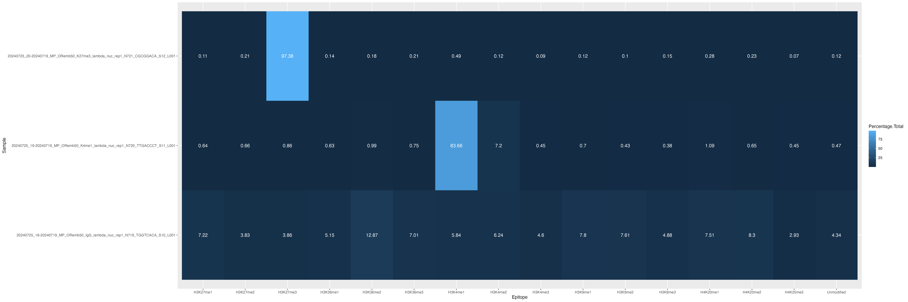

# SNAP-CUTANA Nextflow

A [Nextflow](https://www.nextflow.io/) pipeline to aid in analyzing the SNAP-CUTANA panel from Epicypher for CUT&Tag and CUT&RUN experiments.

## Requirements

Nextflow must be [installed](https://www.nextflow.io/docs/latest/install.html). On Longleaf, just run `module load nextflow` before running the pipeline.

## Running the Workflow

1. Change the params file to point to the directory of reads you wish to analyze, and change the results directory if you wish.
2. Run the following command: `nextflow run workflow.nf -params-file params.yaml`

## Output

You should have a results directory which contains 3 files:

- `barcode_counts.csv`
    - This is a CSV file with the following columns:
        - Read
        - Epitope
        - Alpha Index
        - Read Count
- `heatmap.pdf`
- `heatmap.png`

The heatmaps should look something like this:

The heatmap displays the percentage of reads per sample that map to each epitope.